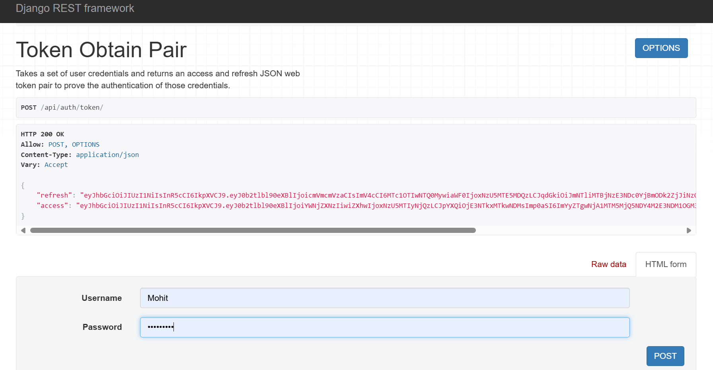
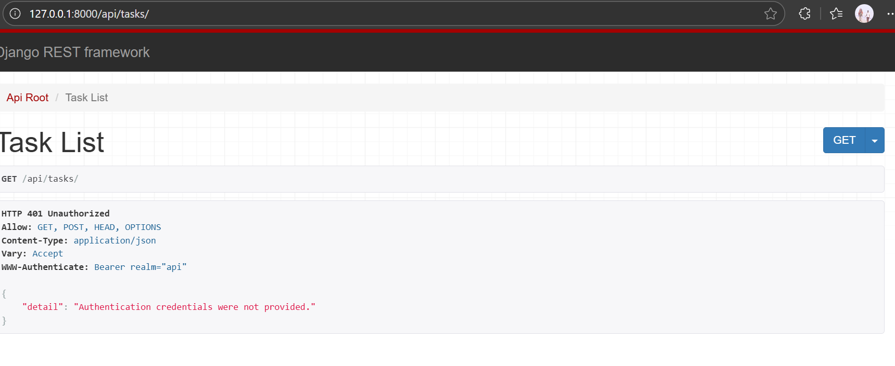

# 🧩 TaskPro – Personal Task Management App

TaskPro is a **full-stack web application** built with **Django** (backend), **SQLite** (database), and **HTML/CSS/JavaScript** (frontend).  
It allows users to **register, log in, and manage their personal tasks** efficiently — including adding, editing, marking as complete, and deleting tasks.

---

## 🚀 Features

- 🔐 User Registration and Authentication (Login/Logout)
- 🗂️ Create, Read, Update, Delete (CRUD) Tasks
- ✅ Mark Tasks as Completed or Pending
- 🕒 Track creation and update timestamps
- 🧠 Simple, clean, and responsive UI
- 💾 Uses **SQLite** for database management

---

## 🏗️ Tech Stack

| Layer | Technology Used |
|-------|------------------|
| Frontend | HTML, CSS, JavaScript |
| Backend | Django (Python) |
| Database | SQLite |
| Authentication | Django built-in auth system |

---

## ⚙️ Installation & Setup

Follow these steps to run TaskPro locally on your PC:

1. **Create a virtual environment**
```bash
python -m venv venv
```

2. **Activate the virtual environment**
```bash
On Windows:

venv\Scripts\activate

On macOS/Linux:

source venv/bin/activate
```
3. **Install dependencies**

- Django>=4.2
- djangorestframework
- djangorestframework-simplejwt
- mysqlclient
- django-filter

4. **Apply migrations**
```bash
python manage.py makemigrations
python manage.py migrate
```

5. **Run the development server**
```bash
python manage.py runserver
```

# Access the app:
- Open your browser and go to: 👉 http://127.0.0.1:8000/

## 🧑‍💻 Usage:

- Register a new user account.

- Log in with your credentials.

- Create, update, or delete tasks.

- Mark tasks as completed when done.

- Log out safely.

## 📸 Screenshots:







# 👨‍💻 Author:
- Mohit Kumar Saini
- Intern - Zignuts Technolab Pvt. Ltd.
