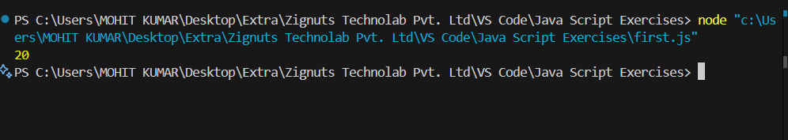
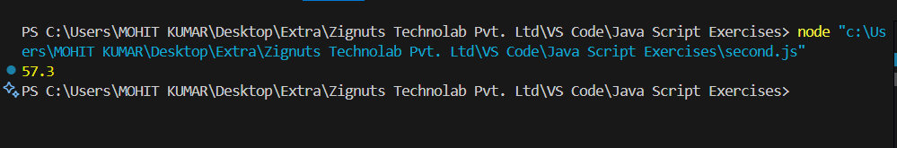
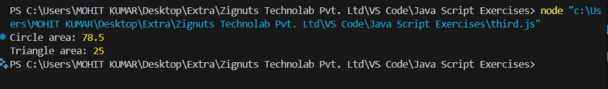
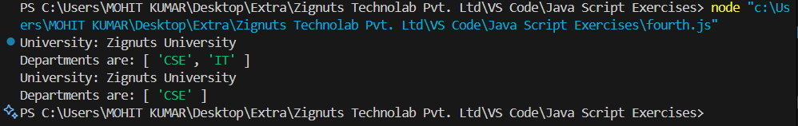
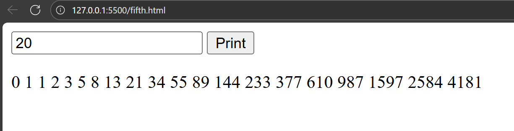
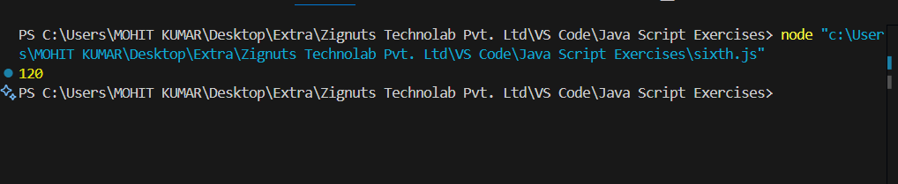

# Session 4 - JavaScript Exercises

This repository branch contains **screenshots of outputs** for Session 4 exercises.

## Task 1: Sum of Numbers in a String
**Code:** [first.js](first.js)  
**Output Screenshot:**  

## Task 2: Sum of Floating Numbers in a String
**Code:** [second.js](second.js)  
**Output Screenshot:**  

## Task 3: Shape, Circle and Triangle
**Code:** [third.js](third.js)  
**Output Screenshot:**  

## Task 4: University Class
**Code:** [fourth.js](fourth.js)  
**Output Screenshot:**  

## Task 5: Fibonacci (HTML)
**Code:** [fifth.html](fifth.html)  
**Output Screenshot:**  

## Task 6: Factorial (Recursion)
**Code:** [sixth.js](sixth.js)  
**Output Screenshot:**  

