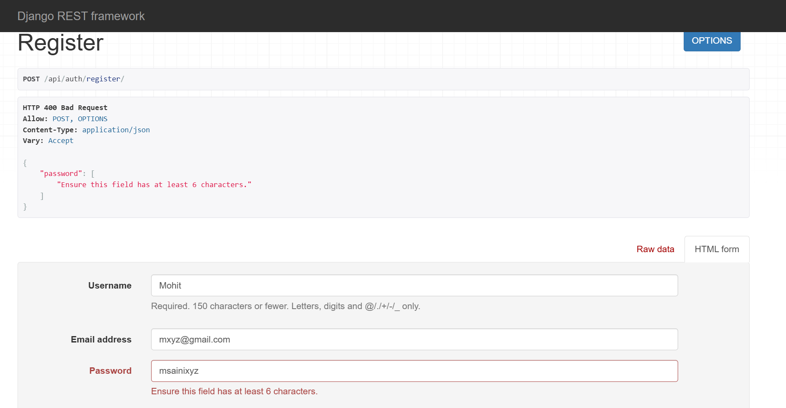
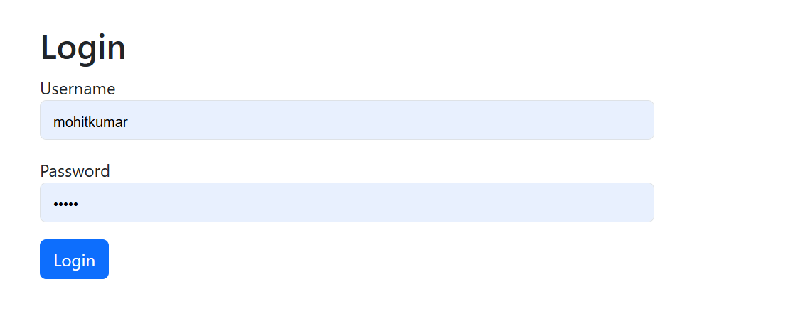
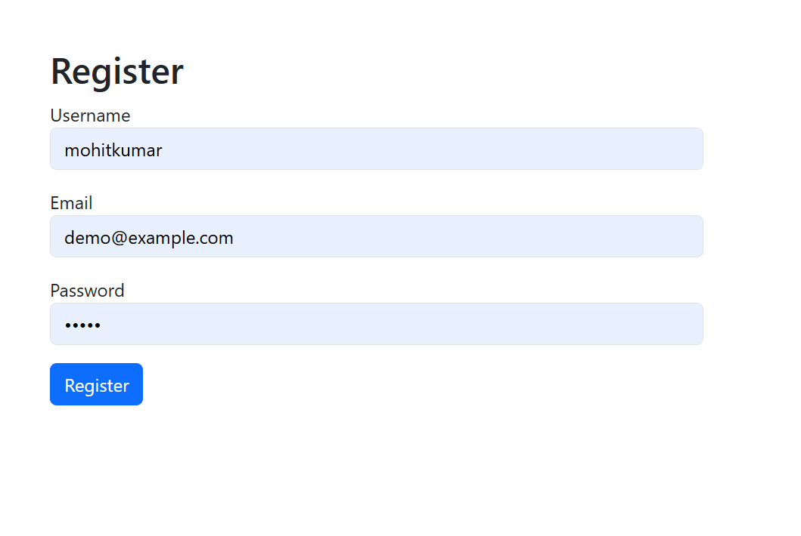
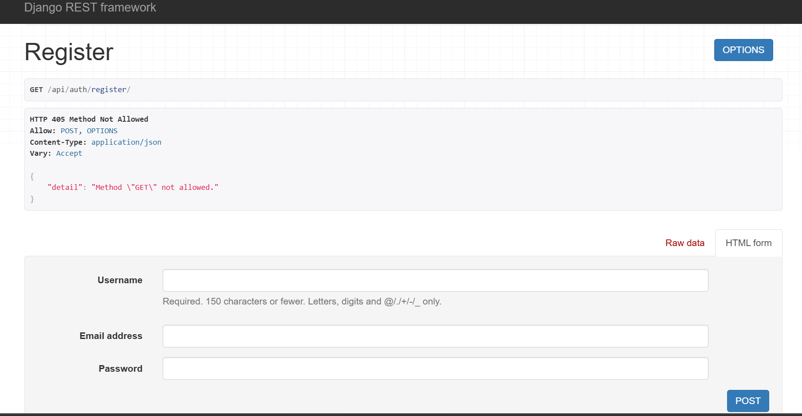

# Django Blog Project – Session 8.1 Minor Project

This is the **Session 8.1 Minor Project** developed as part of my internship learning path at Zignuts.  
It is a simple blog application built using **Django** that demonstrates authentication, CRUD operations, and basic web development concepts.

---

## 🚀 Features

- User registration, login, and logout (Django authentication system).  
- Create, read, update, and delete (CRUD) blog posts.  
- Each post has a title, content, author, and timestamp.  
- Authorization: only the author can edit or delete their own posts.  
- Admin panel to manage users and posts.  
- SQLite database (default Django DB).  
- Basic Bootstrap integration for styling.  
- Screenshots included for project outputs.

---

## 🛠️ Technologies Used

- Python (Django Framework)  
- SQLite (default database)  
- HTML, CSS (Bootstrap for styling)  

---

## ⚙️ How to Run Locally

1. **Clone this repository**  
   ```bash
   git clone https://github.com/<your-username>/<your-repo>.git
   cd <your-repo>

2. **Create virtual environment and activate it**
```bash
python -m venv venv
venv\Scripts\activate   # (Windows)
source venv/bin/activate # (Linux/Mac)
```

3. **Install requirements**
- Django>=4.2,<5
- Pillow

4. **Apply migrations**
```bash
python manage.py migrate
```
5. **Create superuser**
```bash
python manage.py createsuperuser
```
6. **Run server**
```bash
python manage.py runserver
```

## 📸 Outputs / Screenshots








