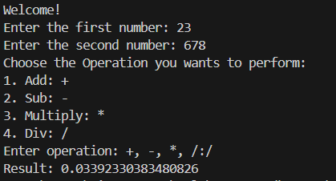
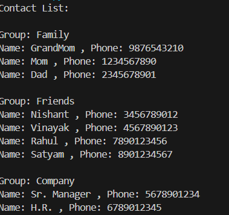
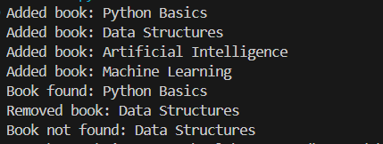
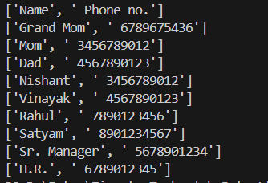

# Session 7 - D.S.A. Exercises

This repository contains my solutions and **screenshots of outputs** for Session 7 - D.S.A. Exercises.

---

## Ex- 1: Write a program to reverse a string without using built-in methods. 
**Code:** [first.py](first.py)  
**Output Screenshot:**  

## Ex- 2: Create a dictionary-based program to manage contacts. Take the complex JSON ( mix of list and dictionary )  and destructure it  
**Code:** [second.py](second.py)  
**Output Screenshot:**  

## Ex- 3: Write a class for a library system that allows adding/removing books and searching by title. 
**Code:** [third.py](third.py)  
**Output Screenshot:**  

## Ex- 4: Create a program to read a CSV file and print its content. 
**Code:** [fourth.py](fourth.py)  
**Output Screenshot:**  

